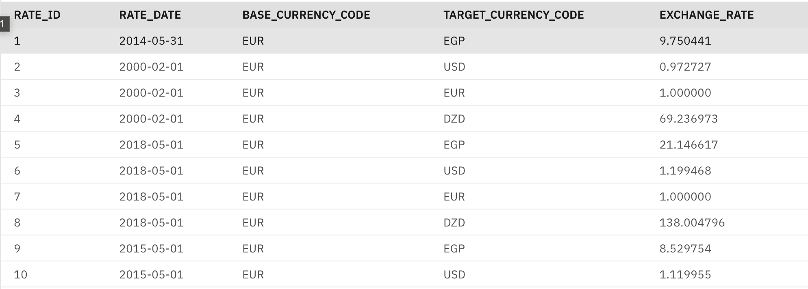

# Currency Exchange Rate ETL & Conversion Toolkit

> Comprehensive Python toolkit for fetching, storing, and converting currency exchange rates using [exchangeratesapi](https://exchangeratesapi.io) and simulated IBM DB2 storage.

---

##  Index

  1. [About The Project](#about-the-project)
  2. [Key Features](#key-features)
  3. [Built With](#built-with)
  4. [Getting Started](#getting-started)
  - [Prerequisites](#prerequisites)
  - [Installation](#installation)
  - [API Key Setup](#api-key-setup)
  - [DB2 Certificate & Credentials](#db2-certificate--credentials)
  5. [Project Architecture](#project-architecture)
  - [Database Schema](#database-schema)
    - [API Endpoints](#api-endpoints)
  6. [Roadmap & Ideas](#roadmap-ideas)


---


## About The Project

This project provides an extensible framework for **extracting, transforming, and loading (ETL)** currency exchange rates using the [exchangeratesapi API](https://exchangeratesapi.io), persisting them to a simulated **IBM DB2** backend, and performing **currency conversions** using both live and historical rates. 
It supports:
- Automated daily, monthly, and annual collection of rates
- Historical queries for arbitrary dates and ranges
- Conversion between key currencies, supporting both real-time and archival data

---

##  Key Features

| Feature         | Description                                                                                 |
|-----------------|--------------------------------------------------------------------------------------------|
|  Real-time Rates  | Fetch latest currency exchange rates from https://exchangeratesapi.io API                             |
|  Historical Rates | Retrieve and store rates for specific days, months, or years                            |
|  Currency Conversion | Convert between supported currencies using live or historical data                 |
|  Simulated DB2 ETL | Store exchange rates for USD, EUR, EGP, DZD in a structured database schema            |
|  Flexible Queries  | Support for daily, monthly, and annual                            |

---

##  Built With

- **Python** 3.x
- `requests`
- `pandas`
- `time`
- `ibm_db`
- `fastapi`
- `uvicorn`
- `gunicorn`

- This project requires the following Python packages, as specified in `requirements.txt`

---

##  Getting Started

### Prerequisites

1. **API Key** 
   - Register at [exchangeratesapi](https://exchangeratesapi.io) and obtain your personal API key.

2. **IBM DB2 Credentials** (don't forget the ssl certificate)
   - Ensure DB2 instance access, or set up with provided simulation.

3. **Python Packages**
   - Install required packages:

```bash
pip3 install requests ibm_db
```

---

### Installation

1. **Clone the repository**

```bash
git clone git@github.com:AhmadNader319/EGP-Converter.git
cd EGP-Converter
```

2. **Install dependencies**

```bash
pip install -r requirements.txt
```

---

### API Key Setup

- Place your API key in an environment variable, configuration file, or directly in the script (discouraged for production).

```python
API_KEY = "YOUR_ExchangeRates_API_KEY"
```

---

### DB2 Certificate & Credentials

For secure DB2 connection, ensure you have:
- Database name 
- Hostname
- Port
- Username & password (user credentials)
- SSL certificate (if required)

These details should be configured in your application's connection logic.

---
##  Project Architecture

### Database Schema

The database schema is designed to efficiently store daily exchange rates for selected currencies:

```
ERD (ER Diagram)
    CURRENCY_RATES {
        timestamp date
        varchar base
        numeric EGP_Rate
        numeric USD_Rate
        numeric EUR_Rate
        numeric DZD_Rate
    }
```

| Column     | Type           | Description                     |
|------------|----------------|---------------------------------|
| date       | `timestamp`    | Date of the rate                |
| base       | `varchar(3)`   | Base currency code              |
| EGP_Rate   | `numeric(1,6)` | Egyptian Pound rate             |
| USD_Rate   | `numeric(1,6)` | US Dollar rate                  |
| EUR_Rate   | `numeric(1,6)` | Euro rate                       |
| DZD_Rate   | `numeric(1,6)` | Algerian Dinar rate             |

---


### API Endpoints

| Purpose          | Endpoint Example                                                                                   |
|------------------|--------------------------------------------------------------------------------------------------|
| Latest Rates     | `https://api.exchangeratesapi.io/v1/latest?access_key=API_KEY`                                       |
| Historical Rates | `https://api.exchangeratesapi.io/v1/YYYY-MM-DD?access_key={API_KEY}`             |

---

##  Roadmap & Ideas

| Idea             | Description                                                                          |
|------------------|--------------------------------------------------------------------------------------|
| **Current Rates**| Fetch and store the latest exchange rates daily                                      |
| **Hist1**        | Store rates from the last 10 days                                                    |
| **Hist2**        | Store rates for a user-specified date                                                |
| **Hist3**        | Store monthly rates from the last 12 months                                          |
| **Hist4**        | Store annual rates for the past 4 years                                              |
| **Hist5**        | Store rates for 30 consecutive days in a selected month                              |
| **Conversion**   | Convert between currencies using either latest or historical rates (user-selectable) |

---

## 📬 Contact

For suggestions, or contributions, please open an issue or submit a pull request on [GitHub](https://github.com/AhmadNader319/EGP-Converter.git).
