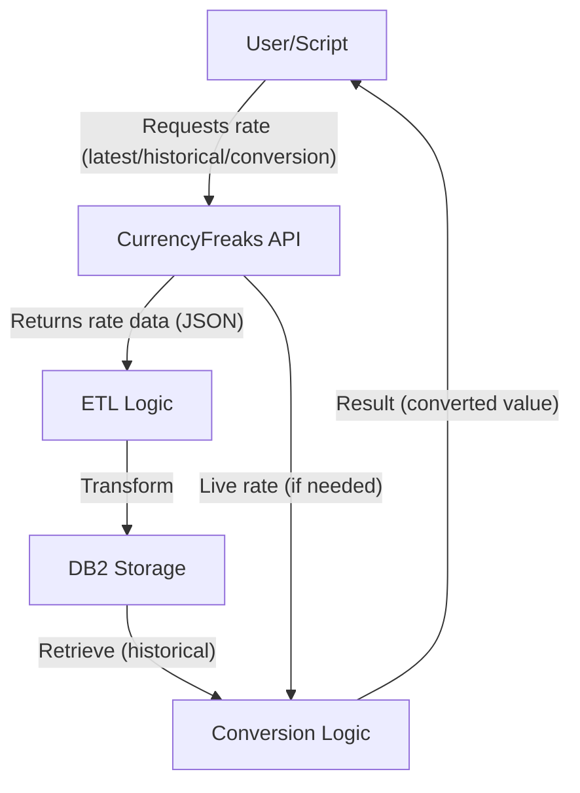
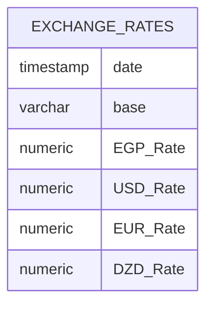

# 💱 Currency Exchange Rate ETL & Conversion Toolkit

> Comprehensive Python toolkit for fetching, storing, and converting currency exchange rates using [CurrencyFreaks API](https://currencyfreaks.com/) and simulated IBM DB2 storage.

---

## 📖 Index

1. [About The Project](#about-the-project)
2. [Key Features](#key-features)
3. [Built With](#built-with)
4. [Getting Started](#getting-started)
   - [Prerequisites](#prerequisites)
   - [Installation](#installation)
   - [API Key Setup](#api-key-setup)
   - [DB2 Certificate & Credentials](#db2-certificate--credentials)
5. [Project Architecture](#project-architecture)
   - [Data Flow Overview](#data-flow-overview)
   - [Database Schema](#database-schema)
   - [API Endpoints](#api-endpoints)
6. [Roadmap & Ideas](#roadmap-ideas)
7. [License](#license)

---

## 📝 About The Project

This project provides an extensible framework for **extracting, transforming, and loading (ETL)** currency exchange rates using the [CurrencyFreaks API](https://currencyfreaks.com/), persisting them to a simulated **IBM DB2** backend, and performing **currency conversions** using both live and historical rates.  
It supports:
- Automated daily, monthly, and annual collection of rates
- Historical queries for arbitrary dates and ranges
- Conversion between key currencies, supporting both real-time and archival data

---

## 🚀 Key Features

| Feature         | Description                                                                                 |
|-----------------|--------------------------------------------------------------------------------------------|
| 🌍 Real-time Rates  | Fetch latest currency exchange rates from CurrencyFreaks API                             |
| 🕰️ Historical Rates | Retrieve and store rates for specific days, months, or years                            |
| 🔄 Currency Conversion | Convert between supported currencies using live or historical data                 |
| 💾 Simulated DB2 ETL | Store exchange rates for USD, EUR, EGP, DZD in a structured database schema            |
| 📅 Flexible Queries  | Support for daily, monthly, annual, and custom date ranges                            |

---

## 🛠️ Built With

- **Python** 3.x
- [`requests`](https://docs.python-requests.org/en/master/): HTTP API communication
- [`ibm_db`](https://pypi.org/project/ibm_db/): (Simulated) IBM DB2 database connectivity
- [`time`](https://docs.python.org/3/library/time.html): Time utilities

---

## 🚦 Getting Started

### Prerequisites

1. **API Key**  
   - Register at [CurrencyFreaks](https://currencyfreaks.com/) and obtain your personal API key.

2. **IBM DB2 Credentials** (for real DB2 use)
   - Ensure DB2 instance access, or set up with provided simulation.

3. **Python Packages**
   - Install required packages:

```bash
pip install requests ibm_db
```

---

### Installation

1. **Clone the repository**

```bash
git clone https://github.com/your-username/currency-etl-toolkit.git
cd currency-etl-toolkit
```

2. **Install dependencies**

```bash
pip install -r requirements.txt
```

---

### API Key Setup

- Place your API key in an environment variable, configuration file, or directly in the script (discouraged for production).

```python
API_KEY = "YOUR_CURRENCYFREAKS_API_KEY"
```

---

### DB2 Certificate & Credentials

For secure DB2 connection, ensure you have:
- Hostname/IP
- Port
- Username & password
- SSL certificate (if required)

These details should be configured in your application's connection logic.

---

## 🏗 Project Architecture

---

### Data Flow Overview

The following diagram illustrates the core workflow of the toolkit:



---

### Database Schema

The database schema is designed to efficiently store daily exchange rates for selected currencies:



| Column     | Type           | Description                     |
|------------|----------------|---------------------------------|
| date       | `timestamp`    | Date of the rate                |
| base       | `varchar(3)`   | Base currency code              |
| EGP_Rate   | `numeric(1,6)` | Egyptian Pound rate             |
| USD_Rate   | `numeric(1,6)` | US Dollar rate                  |
| EUR_Rate   | `numeric(1,6)` | Euro rate                       |
| DZD_Rate   | `numeric(1,6)` | Algerian Dinar rate             |

---

### API Endpoints

| Purpose          | Endpoint Example                                                                                   |
|------------------|--------------------------------------------------------------------------------------------------|
| Latest Rates     | `https://api.currencyfreaks.com/v2.0/latest?apikey=API_KEY`                                       |
| Historical Rates | `https://api.currencyfreaks.com/v2.0/<YYYY-MM-DD>?apikey=API_KEY&symbols=USD,CAD,EUR`             |

---

## 🧩 Roadmap & Ideas

| Idea             | Description                                                                          |
|------------------|--------------------------------------------------------------------------------------|
| **Current Rates**| Fetch and store the latest exchange rates daily                                      |
| **Hist1**        | Store rates from the last 10 days                                                    |
| **Hist2**        | Store rates for a user-specified date                                                |
| **Hist3**        | Store monthly rates from the last 12 months                                          |
| **Hist4**        | Store annual rates for the past 4 years                                              |
| **Hist5**        | Store rates for 30 consecutive days in a selected month                              |
| **Conversion**   | Convert between currencies using either latest or historical rates (user-selectable) |

---

## 📃 License

Distributed under the MIT License. See `LICENSE` for more information.

---

## 📬 Contact

For questions, suggestions, or contributions, please open an issue or submit a pull request on [GitHub](https://github.com/your-username/currency-etl-toolkit).

---

**Happy Coding & Currency Converting!** 🚀
